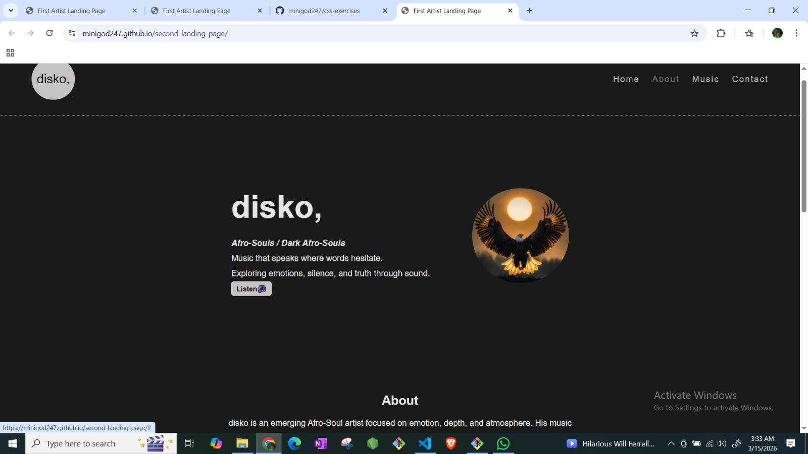

# disko, Artist Landing Page

This is a dark-themed artist landing page built using HTML and CSS.

The page introduces the artist "disko," and includes sections for:
- Hero introduction
- About the artist
- Upcoming music releases
- Quote section
- Social media links

The project is part of my learning journey in web development.

# Learning Highlights

- Built a complete artist landing page using semantic HTML
- Structured layout using CSS Flexbox
- Implemented hover interactions for buttons, links, and images
- Deployed the project using GitHub Pages
- Learned how to resolve Git push errors
- Fixed repository structure for proper GitHub Pages deployment

# Technologies used

HTML
CSS
Git
GitHub

# Preview

# Live demo

[Live Demo](https://minigod247.github.io/second-landing-page/)